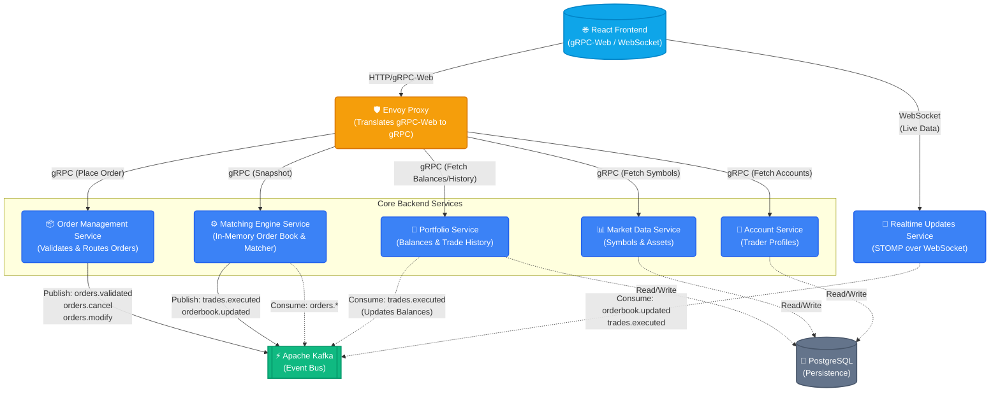

# ProTrade: Distributed Order Matching Engine
ProTrade is a highly scalable, event-driven Order Matching Engine built with a microservices architecture. It supports real-time order book matching, portfolio management, and live market data broadcasting.
The system is designed to handle high-throughput trading with eventual consistency for database persistence, utilizing gRPC for synchronous inter-service communication and Apache Kafka for asynchronous event streaming.

## 📘 User Guide
For a detailed walkthrough of the simulator's features, trading scenarios, and UI screenshots, please refer to our [User Guide](docs/user_guide.md).

## 🏗️ System Architecture
The architecture separates the fast-path execution (in-memory matching) from the slow-path persistence (database writes).

### Microservices Overview
1.  **Account Service:** Manages user profiles, authentication, and roles (Trader vs. Admin).
2.  **Market Data Service:** Manages tradable symbols (e.g., BTC/USDT) and provides historical trade data and market snapshots.
3.  **Portfolio Service:** Manages user wallets. Handles locking balances when orders are placed and settling balances when trades execute.
4.  **Order Management Service (OMS):** The gateway for all trades. Validates sufficient balance via gRPC and publishes validated orders to Kafka.
5.  **Matching Engine Service:** The core algorithmic engine. Maintains in-memory order books and uses a Price-Time Priority matching algorithm. Publishes execution reports back to Kafka.
6.  **Realtime Updates Service:** Consumes Kafka events and pushes live order book and trade updates to the frontend via WebSockets (STOMP).
## 🚀 Tech Stack
*   **Backend:** Java 17, Spring Boot
*   **Frontend:** React 19, Vite, React Router
*   **Communication:** gRPC, gRPC-Web, Protocol Buffers (Protobuf), STOMP WebSockets
*   **Message Broker:** Apache Kafka / Confluent
*   **Database:** PostgreSQL 16
*   **Infrastructure:** Docker, Docker Compose, Envoy Proxy
## 🛠️ How to Run Locally
The entire stack is containerized using Docker Compose for a seamless one-click deployment.
### Prerequisites
*   [Docker](https://docs.docker.com/get-docker/) installed and running.
*   [Docker Compose](https://docs.docker.com/compose/install/) installed.
### Start the Application
1.  Clone the repository and navigate to the project root:
    ```bash
    cd OrderMatchingEngine
    ```
2.  Build and start all services using Docker Compose:
    ```bash
    docker-compose up -d --build
    ```
    *Note: The initial build will take several minutes as it downloads Maven dependencies, compiles the Java microservices, and builds the React frontend.*
3.  Verify the containers are running:
    ```bash
    docker ps
    ```
    You should see containers for PostgreSQL, Zookeeper, Kafka, Envoy, the React Frontend, and all 6 backend Spring Boot microservices.
### Access the Application
*   **Frontend UI:** [http://localhost:3000](http://localhost:3000)
*   **Envoy Proxy (gRPC Gateway):** `localhost:8080`
*   **Kafka UI (Optional Debugging):** [http://localhost:8090](http://localhost:8090)
### Stopping the Application
To shut down the cluster and remove the containers, run:
```bash
docker-compose down
```
*(To wipe the database completely, run `docker-compose down -v` to destroy the volumes).*
## 📖 Development & Protos
All API contracts are defined centrally in the `src/backend/shared-proto` module. 
To make a change to the API:
1. Update the `.proto` files in `shared-proto/src/main/proto`.
2. The Maven build process will automatically generate the corresponding Java classes for the backend.
3. The frontend `package.json` contains scripts to generate the JavaScript gRPC-Web stubs using `protoc`.
