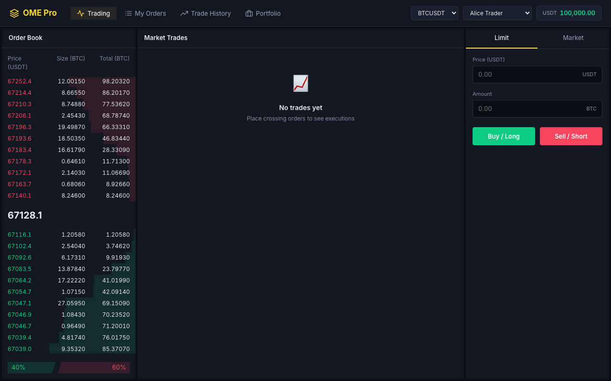
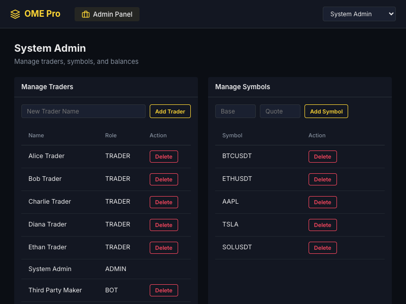
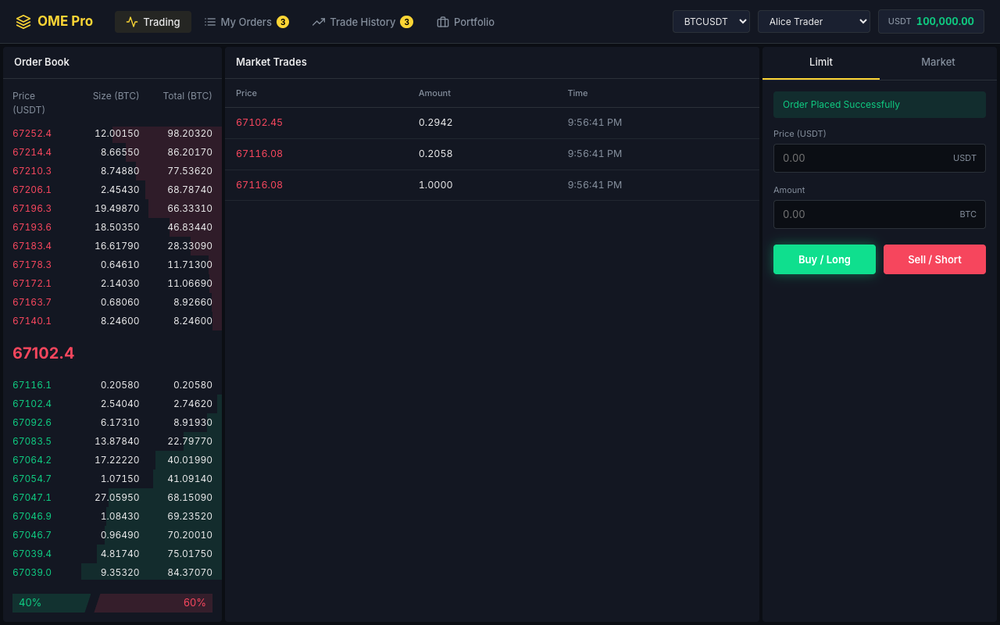
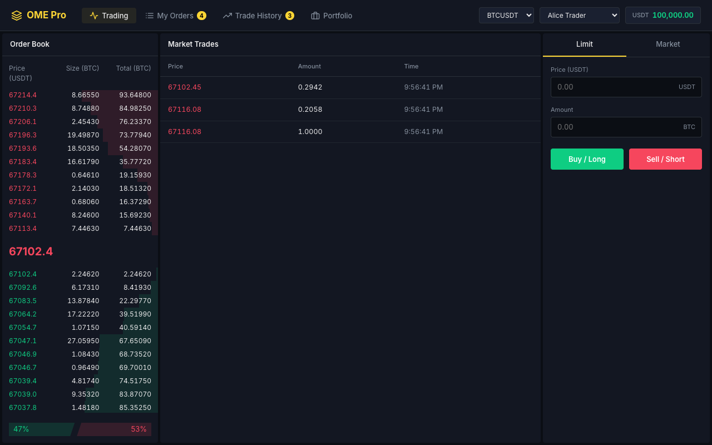

# ProTrade: Order Matching Engine User Guide

Welcome to the **ProTrade Order Matching Engine Simulator**. This platform is designed to emulate how modern electronic exchanges process orders, maintain order books, and update real-time portfolios.

Below is a walkthrough of the core features and various trading scenarios supported by the application.

## System Navigation & Accounts

> **Tip:** The system comes pre-seeded with dummy accounts (Trader and Admin) so you can start testing immediately without needing to sign up.

You can select a different user account from the top navigation dropdown to switch perspectives between different dummy traders or the System Admin.

*Default Trader View.*

*Admin View.*

### 1. Default Trader View
When you launch the application, you're presented with the primary trading view:
- **Order Book**: See all active Bids (buyers) and Asks (sellers) aggregated by price.
- **Buy / Sell Panel**: Form to place new limit or market orders.
- **Open Orders**: Your currently unfilled pending orders.
- **Recent Trades**: Real-time tick updates of the last matched orders.

### 2. Admin View
By switching to the System Admin profile, you can view the market without an active portfolio, typically used for monitoring the health of the engine.

---

## Trading Scenarios

The engine operates on a strict **Price-Time Priority (FIFO)** algorithm. Let's see what happens when you interact with the market.

### Scenario A: Placing Orders (Liquidity Provision)

If you place an order at a price that does not immediately match an existing opposing order, it is added to the Order Book. This provides liquidity to the market.

*Notice how multiple orders build up the order book depth, distinguishing the bid side and ask side.*

### Scenario B: Executing a Trade (Liquidity Taker)

When you place an order with a price that "crosses" the spread (e.g., buying at a price equal to or higher than the best ask), the matching engine instantly pairs your order. 

> **Note:**
> When a trade executes:
> 1. The matched orders are immediately removed or decremented from the Order Book.
> 2. The **Trade History** component pushes a new execution row in real-time.
> 3. Your virtual portfolio balance is instantly adjusted to reflect the settled amounts.

---

## Market Controls

### Modifying and Canceling Orders
- **Cancel**: Open orders can be cancelled anytime by clicking the cross (X) button next to them in your open orders tab.
- **Modify**: Modifying an order adjusts its attributes but may place it at the back of the queue (losing time priority) depending on the exchange rules.

Enjoy using the simulator!
